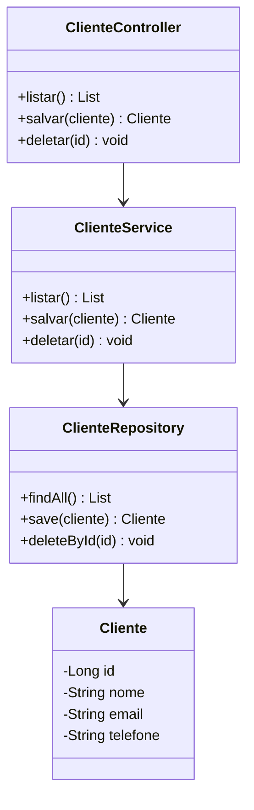
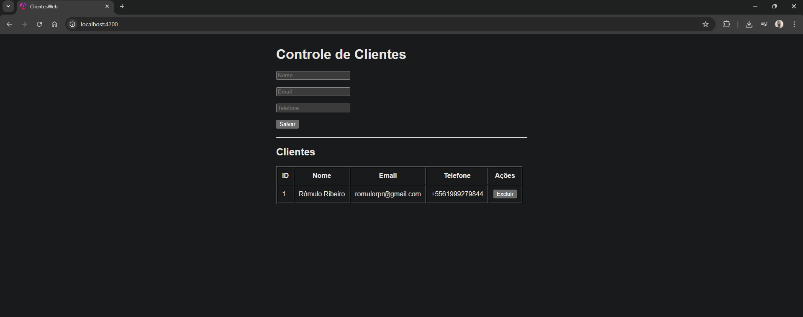

# 📋 Sistema Fullstack — Controle de Clientes

Aplicação fullstack completa para gestão de clientes, com arquitetura em camadas separando Backend e Frontend.

---

## 🎯 Objetivo

Gerenciar operações de CRUD de clientes, garantindo persistência de dados e comunicação eficiente via API REST.

---

## 🛠️ Stack Tecnológica

### Backend (Java)

- **Linguagem:** Java 25
- **Framework:** Spring Boot + Spring Web
- **Persistência:** Spring Data JPA + Hibernate
- **Banco de Dados:** H2 (em memória)
- **Gerenciador:** Maven

### Frontend (Angular)

- **Framework:** Angular
- **Linguagem:** TypeScript
- **Comunicação:** HttpClient (REST)
- **Estilização:** HTML5 + CSS3

---

## 🏗️ Arquitetura

A aplicação segue o padrão MVC em camadas:

| Camada | Responsabilidade |
|---|---|
| Controller | Endpoints REST e entrada de requisições |
| Service | Regras de negócio |
| Repository | Comunicação com o banco via JPA |
| Model | Definição da entidade Cliente |

---

## 📐 Modelagem UML



---

## 🔌 Endpoints da API

| Ação | Método | Endpoint |
|---|---|---|
| Listar todos os clientes | `GET` | `/clientes` |
| Cadastrar novo cliente | `POST` | `/clientes` |
| Remover cliente por ID | `DELETE` | `/clientes/{id}` |

---

## 📁 Estrutura do Projeto

```
clientes-fullstack-jr/
├── backend/     # API REST — Spring Boot
└── frontend/    # SPA — Angular
```

---

## 📸 Preview



---

## 🚀 Como Executar

### Backend

```bash
cd backend
mvn spring-boot:run
```

- API disponível em: `http://localhost:8080/clientes`
- Console H2 disponível em: `http://localhost:8080/h2-console`

### Frontend

```bash
cd frontend/clientes-web
npm install
ng serve
```

- Acesse em: `http://localhost:4200`

---

## 📝 Conceitos Aplicados

- **Fullstack:** Integração completa entre cliente e servidor via REST
- **POO:** Programação Orientada a Objetos com Java
- **JPA/Hibernate:** Mapeamento objeto-relacional
- **Arquitetura em camadas:** Separação de responsabilidades (MVC)

---

## 👤 Autor

**Rômulo Ribeiro**
